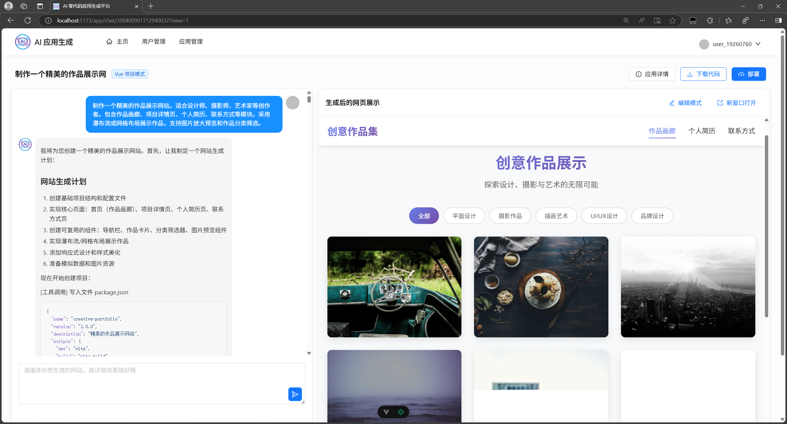
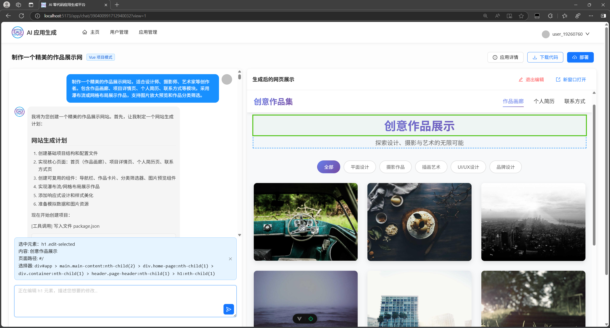
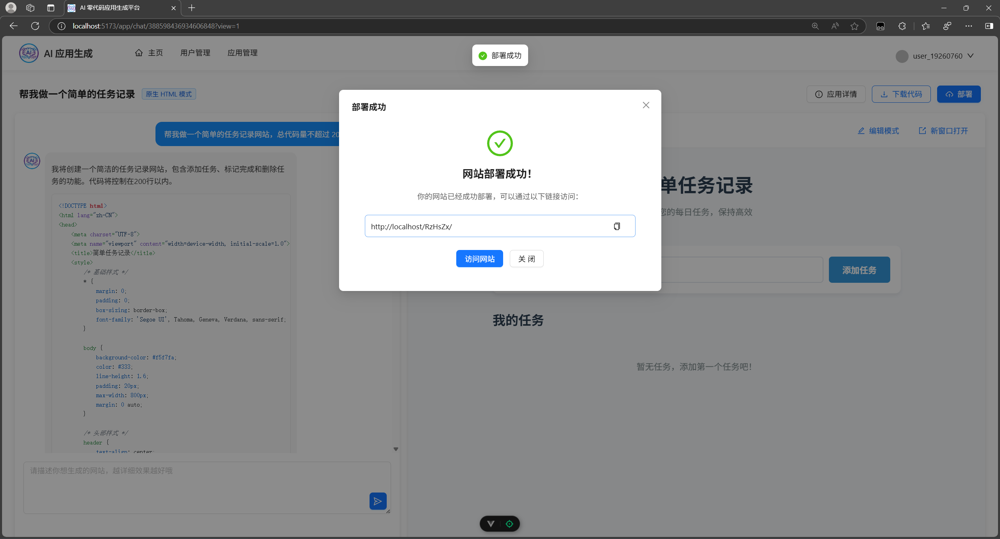
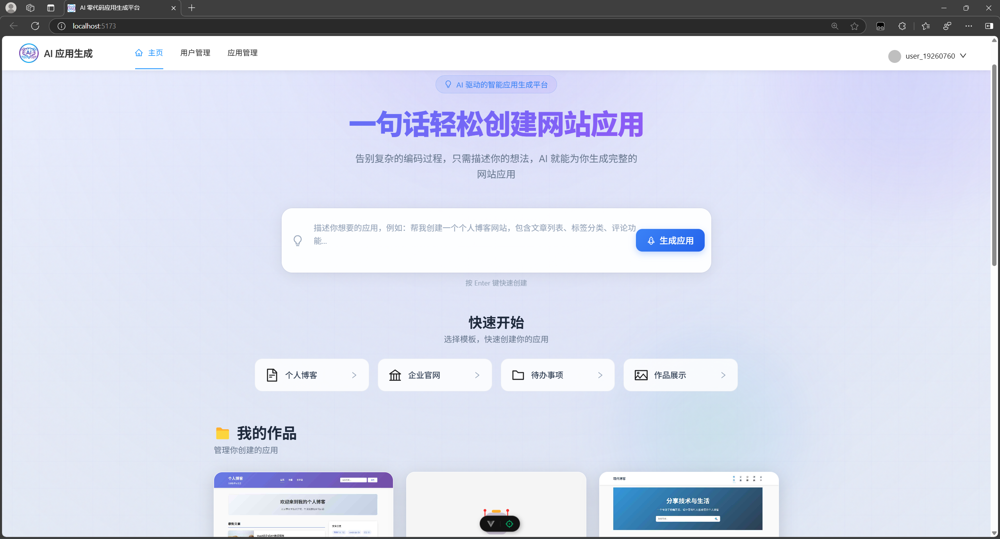

# AI零代码生成平台


> 基于 AI 的零代码应用生成平台，用户通过自然语言描述需求，即可自动生成可运行的应用。

## 特性亮点

- **智能代码生成** - AI 自动分析需求，选择最优生成策略，支持多文件项目构建
- **实时流式输出** - 采用流式响应，实时展示 AI 执行过程
- **可视化编辑** - 生成应用即时预览，支持选择元素与 AI 对话修改
- **一键部署** - 快速生成可访问地址，支持源码下载

---

## 技术架构

### 前端技术栈

| 技术 | 说明 |
|------|------|
| Vue 3 | 渐进式前端框架 |
| Ant Design Vue | 企业级 UI 组件库 |
| Axios | HTTP 请求库 |
| OpenAPI | 接口规范 |

**核心特性**: 内嵌 iframe 实现实时预览

### 后端技术栈

| 分类 | 技术 |
|------|------|
| **基础框架** | Spring Boot 3、Spring Cloud Alibaba |
| **微服务通信** | Dubbo、Nacos、Higress |
| **AI 能力** | LangChain4j、LangGraph4j、Tool Calling、OpenAI、DeepSeek |
| **数据层** | MyBatisFlex、MySQL |
| **缓存** | Redis、Caffeine |
| **文件存储** | 腾讯 COS 对象存储 |
| **并发处理** | Redisson |
| **工具库** | Selenium、jsoup、Lombok、HuTool |
| **文档** | Knife4j + Swagger |

### 部署架构

```
Nginx (反向代理) → 宝塔面板 → 应用服务
```

---

## 功能演示

### 智能代码生成

通过用户需求描述，AI 自动分析并选择合适的生成策略，通过工具调用生成代码文件，采用流式输出让用户实时看到 AI 的执行过程。



### 可视化编辑

生成的应用将实时展示，可以进入编辑模式，选择网页元素快速和 AI 对话修改页面。



### 一键部署

用户可以通过一键部署，生成可访问的地址进行分享，同时可以将源代码下载下来。



---

## 快速开始

### 环境要求

- JDK 21+
- Node.js 22+
- MySQL 8.0+
- Redis
- Nacos

### 后端启动

**Windows:**

```bash
startup.cmd -m standalone
```

**Linux / Mac:**

```bash
sh startup.sh -m standalone
```

### 前端启动

```bash
cd zzx-ai-code-frontend
npm install
npm run dev
```

### 打包部署

```bash
# 本地测试
java -jar zzx-ai-code-0.0.1-SNAPSHOT.jar --spring.profiles.active=prod

# 服务器后台运行
nohup java -jar zzx-ai-code-0.0.1-SNAPSHOT.jar --spring.profiles.active=prod > app.log 2>&1 &
```

### 监控启动 (可选)

```bash
prometheus.exe --config.file=prometheus.yml
```

---

## 项目结构

```
zzx-ai-code/
├── zzx-ai-code-frontend/          # 前端项目
├── zzx-ai-code-microservice/      # 微服务模块
│   ├── zzx-ai-code-common/        # 公共模块
│   ├── zzx-ai-code-model/         # 数据模型
│   ├── zzx-ai-code-user/          # 用户服务
│   ├── zzx-ai-code-app/           # 应用服务
│   ├── zzx-ai-code-ai/            # AI 服务
│   └── zzx-ai-code-screenshot/    # 截图服务
└── img*.png                        # 文档图片
```

---

## 线上部署注意事项

1. 注释 `pom.xml` 中的打包检查命令
2. 修改 `application.yml` 中的 `local` 为 `prod`
3. 修改 `AppServiceImpl` 中的应用部署目录相关代码

---

## 预览效果


